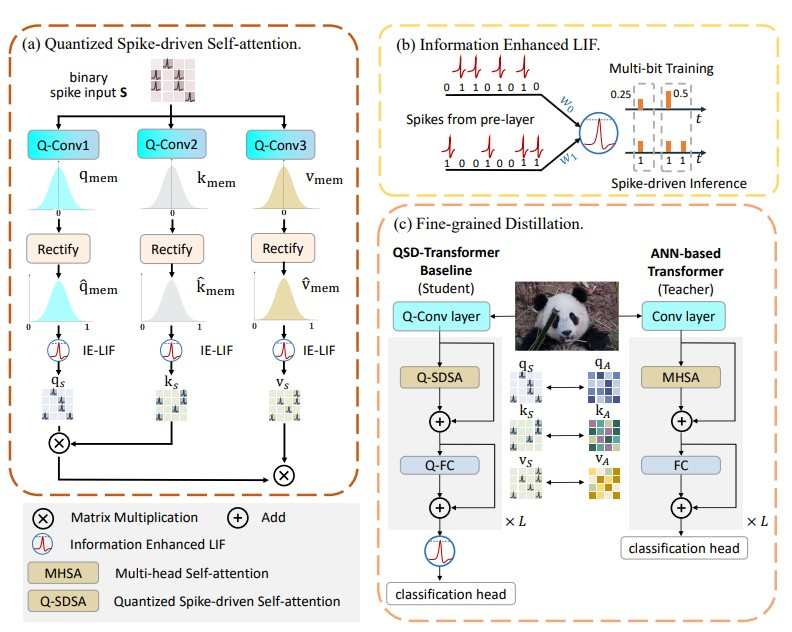
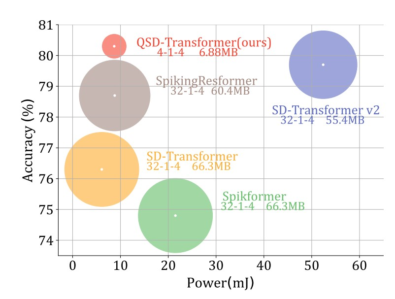

# Quantized Spike-driven Transformer ([ICLR25](https://arxiv.org/abs/2501.13492))

[Xuerui Qiu](https://scholar.google.com/citations?user=bMwW4e8AAAAJ&hl=zh-CN), [Jieyuan Zhang](https://www.ericzhuestc.site/), [Wenjie Wei](), [Honglin Cao](), [Junsheng Guo](), [Rui-Jie Zhu](https://scholar.google.com/citations?user=08ITzJsAAAAJ&hl=zh-CN),[Yimeng Shan](),[Yang Yang](), [Malu Zhang](), [Haizhou Li](https://www.colips.org/~eleliha/)

University of Electronic Science and Technology of China

Institute of Automation, Chinese Academy of Sciences


### Instructions for running the code:
> **Quantization Model ImageNet From Scratch**: See [Train_Base.md](classification/readme.md).\
> **Object Detection**: See [Detection.md](det/readme.md).\
> **Semantic Segmentation**: See [Segementation.md](seg/readme.md)


:rocket:  :rocket:  :rocket: **News**:

- **Jan. 24, 2025**: Release the code for training and testing.

## Abstract
Spiking neural networks (SNNs) are emerging as a promising energy-efficient alternative to traditional artificial neural networks (ANNs) due to their spike-driven paradigm. However, recent research in the SNN domain has mainly focused on enhancing accuracy by designing large-scale Transformer structures, which typically rely on substantial computational resources, limiting their deployment on resource-constrained devices. To overcome this challenge, we propose a quantized spike-driven Transformer baseline (QSD-Transformer), which achieves reduced resource demands by utilizing a low bit-width parameter. Regrettably, the QSD-Transformer often suffers from severe performance degradation. In this paper, we first conduct empirical analysis and find that the bimodal distribution of quantized spike-driven self-attention (Q-SDSA) leads to spike information distortion (SID) during quantization, causing significant performance degradation. To mitigate this issue, we take inspiration from mutual information entropy and propose a bi-level optimization strategy to rectify the information distribution in Q-SDSA. Specifically, at the lower level, we introduce an information-enhanced LIF to rectify the information distribution in Q-SDSA. At the upper level, we propose a fine-grained distillation scheme for the QSD-Transformer to align the distribution in Q-SDSA with that in the counterpart ANN. By integrating the bi-level optimization strategy, the QSD-Transformer can attain enhanced energy efficiency without sacrificing its high-performance advantage. We validate the QSD-Transformer on various visual tasks, and experimental results indicate that our method achieves state-of-the-art results in the SNN domain. For instance, when compared to the prior SNN benchmark on ImageNet, the QSD-Transformer achieves 80.3% top-1 accuracy, accompanied by significant reductions of 6.0x and 8.1x in power consumption and model size, respectively.



## Results
In this paper, we first introduce the lightweight spike-driven transformer, namely the QSDTransformer, which quantifies the weights from 32-bit to low-bit. By employing both low-bit weights and 1-bit spike activities, QSD-Transformer has demonstrated significant energy efficiency. Despite exhibiting efficiency benefits, the QSD-Transformer suffers from performance degradation. We reveal that this is attributed to the SID problem and propose a bi-level optimization strategy to solve this challenge. At the lower level, we propose the IE-LIF neuron, which generates multi-bit spikes in training while maintaining spike-driven behavior during inference. At the upper level, we introduce the FGD scheme, which optimizes attention distribution between the Q-SDSA and its ANN counterpart. Extensive experiments show that our method achieves state-of-the-art results in both performance and efficiency on various vision tasks, paving the way for the practical deployment of spike-based Transformers in resource-limited platforms.




## Contact Information
If you find this repository useful, please consider giving a star ⭐ and citation.

```
@inproceedings{qiu2025quantized,
              title={Quantized Spike-driven Transformer},
              author={Xuerui Qiu and Jieyuan Zhang and Wenjie Wei and Honglin Cao and Junsheng Guo and Rui-Jie Zhu and Yimeng Shan and Yang Yang and Malu Zhang and Haizhou Li},
              booktitle={The Thirteenth International Conference on Learning Representations},
              year={2025},
              url={https://openreview.net/forum?id=5J9B7Sb8rO}
}
```

For help or issues using this git, please submit a GitHub issue.

For other communications related to this git, please contact  `qiuxuerui2024@ia.ac.cn`.

## Acknowledgement
The object detection and semantic segmentation parts are based on [MMDetection](https://github.com/open-mmlab/mmdetection) and [MMSegmentation](https://github.com/open-mmlab/mmsegmentation) respectively. Thanks for their wonderful work.
